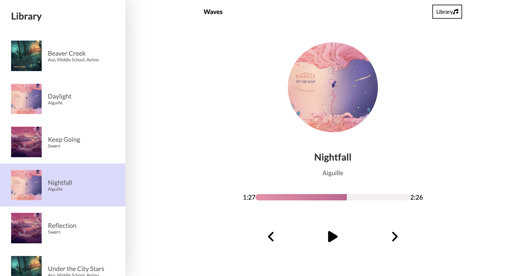

# Music Player

## Table of contents

- [Overview](#overview)
  - [The challenge](#the-challenge)
  - [Screenshot](#screenshot)
  - [Links](#links)
- [My process](#my-process)
  - [Built with](#built-with)
- [Linkedin](#linkedin)
- [Getting Started with Create React App](#react)

## Overview

### The challenge

Users should be able to:

- Play, pause a song.
- Skip forward and backward to another song.
- Easily identify which song is currently playing.
- Minimize the menu for a cleaner interface.
- View a slider with colors that correspond to the current song being played.
- Have a seamless experience on both mobile and desktop devices.

### Screenshot

### Links

- [Live Site URL](https://main--cc-music-app.netlify.app/)

## My process

### Built with

- [React](https://reactjs.org/) - JS library
- [SCS](https://sass-lang.com/) - For styles

## Linkedin
- [https://www.linkedin.com/in/camillecalas](https://www.linkedin.com/in/camillecalas/)

## Getting Started with Create React App

In the project directory, you can run:

`npm start`
Runs the app in the development mode.
Open http://localhost:3000 to view it in your browser.

The page will reload when you make changes.
You may also see any lint errors in the console.
